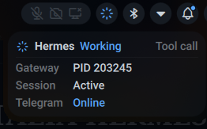
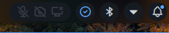

# noctalia-hermes

[noctalia-shell](https://github.com/noctalia-dev/noctalia-shell) 插件 — 在状态栏实时显示 [Hermes Agent](https://github.com/nousresearch/hermes-agent) 的运行状态。

通过 hermes shell hooks 记录 Hermes 生命周期事件，noctalia 插件监听状态文件变化并立即刷新；同时保留低频轮询作为兜底。
Hook 写入通常低于 1 秒；状态栏 UI 会在信号文件变化后快速刷新，默认每 30 秒额外兜底检查一次 Gateway/平台状态。

## 效果




状态栏显示一个交通灯图标，随 hermes 状态实时变化：

| 图标 | 颜色 | 状态 | 触发条件 |
|------|------|------|----------|
| ✓ | 绿色 | Online | Gateway 运行中，空闲 |
| ⟳ | 蓝色 | Busy | 正在思考、执行工具、处理中 |
| 🔔 | 琥珀色 | Needs You | 等待用户审批命令或回答问题 |
| ⚠ | 橙色 | Degraded | 平台连接异常（如 Telegram 断线） |
| ⏻ | 红色 | Offline | Gateway 未运行 |

点击图标弹出详情面板，显示 Gateway PID、会话状态、平台连接。

## 架构

```
hermes hooks (事件记录)
    │
    ▼
hermes-status-hook    ← 写信号文件 ~/.hermes/status_signal
    │
    ▼
hermes-status-check   ← 综合检测脚本，输出 JSON
    │
    ▼
noctalia plugin (QML) ← 监听 status_signal 变化，默认每 30 秒兜底轮询
```

### 状态检测优先级

1. **Hook 信号** — hermes 生命周期事件实时写入（最高优先级）
2. **进程检测** — 检查 CLI 会话和 Gateway 进程是否存在
3. **平台状态** — 读取 gateway_state.json 检测连接异常
4. **Manual Attention 标志** — `hermes-attention` 手动设置的提醒文件

busy 信号超过 30 秒未更新自动回退到 idle，防止 hermes 异常退出后状态卡住。attention 信号会保持到 Hermes 发出 `post_approval_response`，手动 attention 则保持到 `hermes-attention clear`。

## 安装

### 方式 A：一键安装

```bash
git clone https://github.com/Mel-SRK/noctalia-hermes ~/.local/share/noctalia-hermes
cd ~/.local/share/noctalia-hermes
./install.sh
```

`install.sh` 会：

- 把插件链接到 `~/.config/noctalia/plugins/hermes-status`
- 安装 `hermes-status-check` 到 `~/.config/noctalia/hermes-status-check`
- 安装 `hermes-status-hook` 和 `hermes-attention` 到 `~/.local/bin`

之后仍需按下面的“配置 hermes hooks”步骤修改 `~/.hermes/config.yaml`。

### 方式 B：手动安装

#### 1. 克隆项目

把项目放到任意你喜欢的位置即可，下面用 `~/.local/share/noctalia-hermes` 作为示例：

```bash
git clone https://github.com/Mel-SRK/noctalia-hermes ~/.local/share/noctalia-hermes
cd ~/.local/share/noctalia-hermes
```

如果你使用 fork，请把上面的仓库地址替换成自己的 fork 地址。

#### 2. 安装插件到 noctalia

```bash
mkdir -p ~/.config/noctalia/plugins
ln -sfn ~/.local/share/noctalia-hermes/hermes-status ~/.config/noctalia/plugins/hermes-status
```

#### 3. 安装辅助脚本

```bash
mkdir -p ~/.config/noctalia ~/.local/bin

# 状态检测脚本（noctalia 插件调用）
install -m 755 ~/.local/share/noctalia-hermes/hermes-status-check ~/.config/noctalia/hermes-status-check

# Hook 脚本（hermes 调用）
install -m 755 ~/.local/share/noctalia-hermes/hermes-status-hook ~/.local/bin/hermes-status-hook

# 可选：手动设置 attention 标志的工具
install -m 755 ~/.local/share/noctalia-hermes/hermes-attention ~/.local/bin/hermes-attention
```

确保 `~/.local/bin` 在 `PATH` 中：

```bash
case ":$PATH:" in
  *":$HOME/.local/bin:"*) ;;
  *) echo 'export PATH="$HOME/.local/bin:$PATH"' >> ~/.profile ;;
esac
```

### 配置 hermes hooks

在 `~/.hermes/config.yaml` 的 `hooks:` 段添加：

```yaml
hooks:
  pre_llm_call:
    - command: "~/.local/bin/hermes-status-hook pre_llm_call"
  post_llm_call:
    - command: "~/.local/bin/hermes-status-hook post_llm_call"
  pre_tool_call:
    - command: "~/.local/bin/hermes-status-hook pre_tool_call"
  post_tool_call:
    - command: "~/.local/bin/hermes-status-hook post_tool_call"
  pre_approval_request:
    - command: "~/.local/bin/hermes-status-hook pre_approval_request"
  post_approval_response:
    - command: "~/.local/bin/hermes-status-hook post_approval_response"
  on_session_start:
    - command: "~/.local/bin/hermes-status-hook on_session_start"
  on_session_end:
    - command: "~/.local/bin/hermes-status-hook on_session_end"
  on_session_finalize:
    - command: "~/.local/bin/hermes-status-hook on_session_finalize"
```

### 重启服务

```bash
# 重启 noctalia-shell 加载插件
pkill -x qs
qs -c noctalia-shell -d

# 重启 hermes gateway 加载 hooks
hermes gateway restart
```

之后新启动的 `hermes chat` 会话会自动加载 hooks。

## 文件说明

```
noctalia-hermes/
├── README.md
├── hermes-status/              ← noctalia 插件（放到 plugins/ 目录）
│   ├── manifest.json           ← 插件元数据和默认配置
│   ├── Main.qml                ← 后台逻辑（监听信号文件 + 兜底轮询）
│   ├── BarWidget.qml           ← 状态栏图标（交通灯）
│   ├── Panel.qml               ← 点击弹出的详情面板
│   └── Settings.qml            ← 插件设置界面
├── hermes-status-check         ← 状态检测脚本（单 Python 进程综合判断）
├── hermes-status-hook          ← Hook 脚本（hermes 事件记录）
└── hermes-attention            ← 手动设置 attention 标志的工具
```

### hermes-status-check

被 noctalia 插件在信号文件变化时调用，并默认每 30 秒兜底调用一次，输出 JSON 状态：

```json
{
  "status": "idle",
  "gateway_running": true,
  "gateway_pid": "203245",
  "cli_active": true,
  "cli_pid": "9329",
  "needs_attention": false,
  "signal_event": "post_tool_call",
  "signal_ts": "2026-05-29T14:00:00+08:00",
  "signal_age": 3,
  "platforms": {"telegram": {"state": "connected"}}
}
```

### hermes-status-hook

被 hermes hooks 系统调用，根据事件类型写入信号文件：

| Hook 事件 | 信号状态 | 含义 |
|-----------|----------|------|
| `pre_llm_call` | busy | 开始调用 LLM |
| `post_llm_call` | busy | LLM 返回结果 |
| `pre_tool_call` | busy | 即将执行工具 |
| `post_tool_call` | busy | 工具执行完成 |
| `on_session_start` | busy | 会话开始 |
| `pre_approval_request` | attention | 等待用户审批 |
| `post_approval_response` | idle | 用户已响应 |
| `on_session_end` | idle | 会话结束 |
| `on_session_finalize` | idle | 会话清理完成 |

### hermes-attention

手动管理 attention 标志的工具：

```bash
hermes-attention set     # 设置黄色铃铛
hermes-attention clear   # 清除
hermes-attention status  # 查看状态
```

## 配置

在 noctalia Settings → Plugins → Hermes Agent 中可调整：

| 选项 | 默认值 | 说明 |
|------|--------|------|
| Status check script | `~/.config/noctalia/hermes-status-check` | 检测脚本路径 |
| Poll interval | 30s | 兜底轮询间隔；hook 状态变化会通过文件监听立即刷新 |
| Signal file | `~/.hermes/status_signal` | Hermes hook 写入的状态信号文件 |
| Hide when idle | false | 正常运行时隐藏图标 |

## 依赖

- [noctalia-shell](https://github.com/noctalia-dev/noctalia-shell) — Wayland 桌面 shell
- [Hermes Agent](https://github.com/nousresearch/hermes-agent) — AI 助手
- python3

## License

MIT
